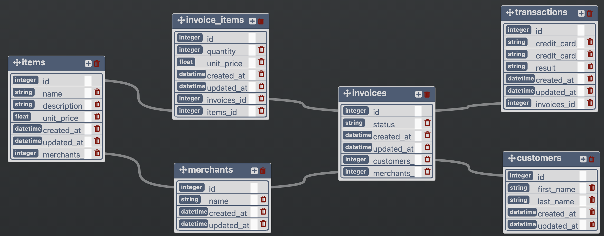

# Rails Engine

## About this Project

This project simulates the back-end for an E-Commerce site and is currently for demonstration purposes; only available locally.

## Author: Diana Buffone
  [GitHub](https://github.com/Diana20920) |
  [LinkedIn](https://www.linkedin.com/in/dianabuffone/)

## Table of Contents

  - [Getting Started](#getting-started)
  - [Running the tests](#running-the-tests)
  - [DB Schema](#db-schema)
  - [Endpoints](#endpoints)
  - [Built With](#built-with)
  - [Gems Used](#gems-used)
  - [Versioning](#versioning)
  - [Acknowledgements](#acknowledgements)

## Getting Started

To run the web application on your local machine, you can fork and clone down the repo and follow the installation instructions below.

### Installing

1. Install the gem packages: run `bundle install`
2. Add the following to your `db/seeds.rb` file (do not seed yet)
```ruby
cmd = "pg_restore --verbose --clean --no-acl --no-owner -h localhost -U $(whoami) -d rails-engine_development db/data/rails-engine-development.pgdump"
puts "Loading PostgreSQL Data dump into local database with command:"
puts cmd
system(cmd)
```
3. Run `rails db:{drop,create,migrate,seed}` and you may see lots of output including some warnings/errors from pg_restore
4. Run `rails db:schema:dump`
  - Check to see that your `schema.rb` exists and has the proper tables/attributes that match the data in Postico. You can do the following to check to see if you have set up rails to effectively communicate with the database.

  <details>
  <summary>Click to view steps</summary>

    - Add a `customer.rb` file to your models directory
    - Create a Customer class that inherits from ApplicationRecord
    - run `rails c` to jump into your rails console.
    - run `Customer.first` to see the object:
      ```sql
      #<Customer id: 1, first_name: "Joey", last_name: "Ondricka", created_at: "2012-03-27 14:54:09", updated_at: "2012-03-27 14:54:09">
      ```
    - run `Customer.last` to see the object:
      ```sql
      #<Customer id: 1000, first_name: "Shawn", last_name: "Langworth", created_at: "2012-03-27 14:58:15", updated_at: "2012-03-27 14:58:15">
      ```
  </details>

If this all checks out you should be good to go.

### Prerequisites

To run this application you will need Ruby 2.5.3 and Rails 5.2.5

## Running the tests
RSpec testing suite is utilized for testing this application.
- Run `bundle exec rspec` to confirm that all tests are passing

## DB Schema
The following is a depiction of the original Database Schema


## Endpoints

### Section One
RESTful API endpoints with one example request and its response
- `GET /api/v1/items` and `GET /api/v1/merchants`
  - With *optional* query parameters (`per_page` and `page`)
    - `per_page`, an integer value of how many resources should be in the output; defaults to 20 if not specified by the user
    - `page`, an integer value of a “page” of resources to skip before returning data; defaults to 1 if not specified by the user

  <details>
  <summary>Example request and response </summary>

  `GET /api/v1/merchants?per_page=2`
  ```json
  {
      "data": [
          {
              "id": "1",
              "type": "merchant",
              "attributes": {
                  "name": "Schroeder-Jerde"
              }
          },
          {
              "id": "2",
              "type": "merchant",
              "attributes": {
                  "name": "Klein, Rempel and Jones"
              }
          }
      ]
  }
  ```
  </details>

- `GET /api/v1/items/:id`
- `GET /api/v1/items/:id/merchant`
- `POST /api/v1/items`
- `PATCH /api/v1/items/:id`
- `DELETE /api/v1/items/:id`
- `GET /api/v1/merchants/:id`
- `GET /api/v1/merchants/:id/items`

### Section Two
Non-RESTful Search Endpoints.
- `GET /api/vi/items/find_all`, find *all* items which match a search term

  These endpoints will make use of query parameters (`name`, `min_price`, `max_price`, and a combination of `min_price` with `max_price`).
- `GET /api/vi/merchants/find`, find *a single* merchant which matches a search term

  These endpoints will make use of the `name` query parameter.

  **Example Endpoints**
  - `GET /api/v1/merchants/find?name=Mart`
  - `GET /api/v1/items/find_all?name=ring`
  - `GET /api/v1/items/find_all?min_price=50`
  - `GET /api/v1/items/find_all?max_price=150`
  - `GET /api/v1/items/find_all?max_price=150&min_price=50`

### Section Three
Non-RESTful Business Intelligence Endpoints
- `GET /api/v1/revenue/merchants?quantity=2`, return a number of merchants ranked by total revenue.
#### To Be Implemented
- `GET /api/v1/merchants/most_items?quantity=2`, return a variable number of merchants ranked by total number of items sold.
- `GET /api/v1/revenue/merchants/1`, return the total revenue for a single merchant
- `GET /api/v1/revenue/items?quantity=1`, return a quantity of items ranked by descending revenue

## Built With
- Ruby
- Rails
- RSpec

## Gems Used
- fast_jsonapi
- capybara
- simplecov
- shoulda-matchers
- acticve_designer
- factory_bot_rails
- faker
- pry
- rspec-pride

## Versioning
- Ruby 2.5.3
- Rails 5.2.6

## Acknowledgements
A big thank you to my fellow Software Engineers that contributed to my continued learning while working on this project.
- Khoa | [GitHub](https://github.com/Omegaeye)
- Brisa | [GitHub](https://github.com/brisag)
- Andrew | [GitHub](https://github.com/avjohnston)
